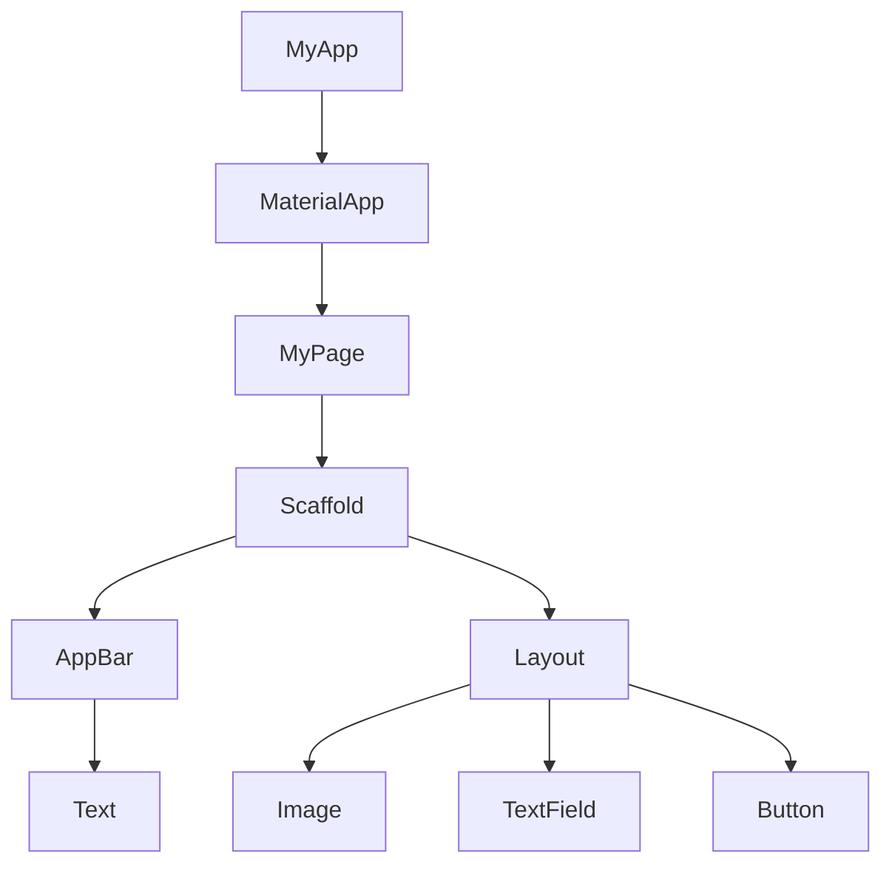

## 위젯
- 화면상에 배치되는 이미지, 텍스트, 버튼등의 모든 요소를 위젯이라고 한다.
- 위젯은 Stateless, Stateful, Inherited 위젯으로 나뉜다.
- Stateless : 정적인 위젯으로 value 값을 가지지 않는다.
- Stateful : 동적인 위젯

## 위젯트리
- 위젯들의 계층구조를 위젯트리라고 한다.
- 한 위젯이 다른 위젯에 포함될 수 있으며, 서로 부모와 자식 관계를 가진다.
- Parent widget 은 widget container 라고 부르기도 한다.

##  위젯트리 구조
- 위젯의 최상위 트리에는 MyApp -> MaterialApp-> MyHomePage -> Scaffold -> UI... 가 존재한다.
- Material 플러터 프레임워크와 구글이 제공하는 Material 디자인 테마요소들을 포함하고 있다. 
- MyHomePage 위젯은 커스텀 영역이다. 위젯의 이름은 변경하여도 된다.
- Scaffold 하위 위젯은 UI 관련 위젯들로 구성되는데, Appbar, Layout 을 기본으로 화면을 구성하는데 쓰인다.

